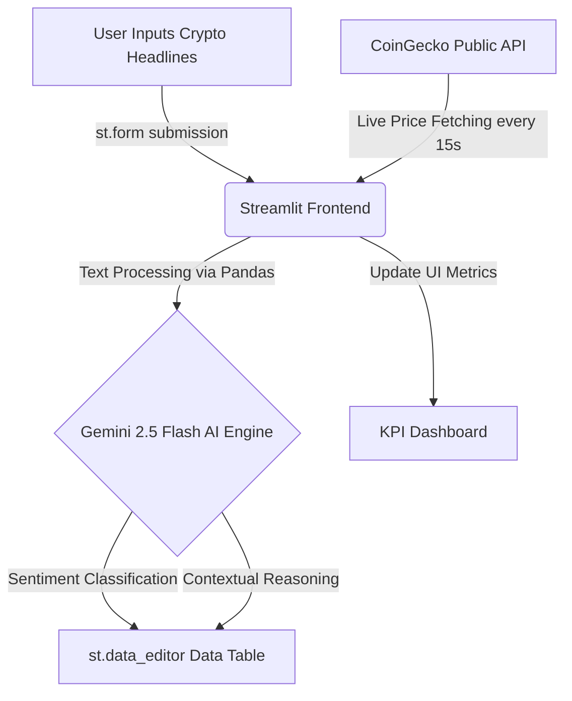

# 📈 Crypto Sentiment Terminal

> **MirAI School of Technology: Capstone Project**  
> **Domain:** FinTech, Quants & Economics  
> **Built with:** Streamlit & Google Gemini AI

```console
$ status
System: Online
AI Engine: Gemini 2.5 Flash
Data Source: CoinGecko API & News Inputs
```

## 🧠 System Architecture
This application utilizes a modern, serverless architecture combining the speed of Streamlit with the analytical power of the Gemini API.



## 🛠️ Setup Instructions

**1. Clone or Copy the Repository**
Ensure you have Python installed on your system. 

**2. Install Dependencies**
```bash
pip install -r requirements.txt
```

**3. Run the Application**
```bash
streamlit run app.py
```

## 🚀 Live Application Link
*Replace this with your deployed Streamlit Community Cloud URL before submission.*
`https://amandeeppal0001-crypto-sentiment-terminal-app-bxb3rv.streamlit.app/`
